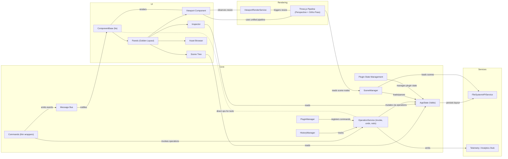

# Pix3 Architecture Diagram

This document contains a high-level architecture diagram for Pix3 and notes about viewing and exporting diagrams in VS Code. It reflects the current operations-first model where the OperationService is the single entry point for mutations and history.

## Mermaid diagram

Below is a Mermaid system diagram that represents the architecture described in `pix3-specification.md` (v1.8, operations-first).

## Roles

Pix3 is designed for a range of users with different priorities and workflows. The architecture supports flexible UI layouts, plugin APIs, and export options to meet these needs.