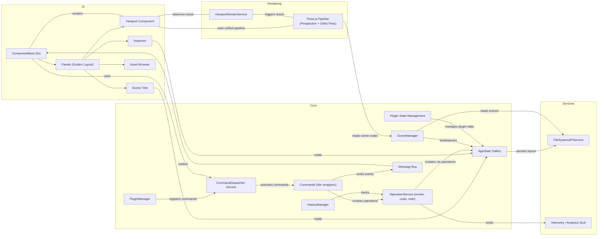

# Pix3 Architecture Diagram

This document contains a high-level architecture diagram for Pix3 and notes about viewing and exporting diagrams in VS Code. It reflects the current operations-first model where the CommandDispatcher Service is the primary entry point for all actions, ensuring consistent lifecycle management and preconditions checking.

## Mermaid diagram

Below is a Mermaid system diagram that represents the architecture described in `pix3-specification.md` (v1.8, operations-first).



## Command-Driven Menu System

Menu items are generated from registered commands using metadata. This pattern replaces hardcoded menu structures with a flexible, extensible approach.

### CommandMetadata Extension
```typescript
interface CommandMetadata {
  // ... existing properties ...
  readonly menuPath?: string;    // 'edit', 'file', 'view', 'help'
  readonly shortcut?: string;    // '⌘Z', 'Ctrl+S' (display only)
  readonly addToMenu?: boolean;  // Include in main menu
}
```

### Menu Generation Flow
1. Commands register with CommandRegistry at app startup
2. CommandRegistry.buildMenuSections() groups commands by menuPath
3. Pix3MainMenu loads sections and renders menu items
4. Menu clicks execute commands via CommandDispatcher

### Execution Path
```
User clicks menu item
  ↓
Pix3MainMenu.executeMenuItem(commandId)
  ↓
CommandDispatcher.execute(command)
  ↓
Preconditions checked → Command.execute()
  ↓
Operation performed via OperationService
```

### Example: Adding to Edit Menu
```typescript
export class MyCommand extends CommandBase<void, void> {
  readonly metadata: CommandMetadata = {
    id: 'edit.mycommand',
    title: 'My Command',
    menuPath: 'edit',        // Groups under Edit menu
    shortcut: '⌘M',
    addToMenu: true,
  };
  // ... implementation
}

// In editor shell:
this.commandRegistry.register(new MyCommand(dependencies));
```

The menu automatically updates without component changes.

## Roles

Pix3 is designed for a range of users with different priorities and workflows. The architecture supports flexible UI layouts, plugin APIs, and export options to meet these needs.