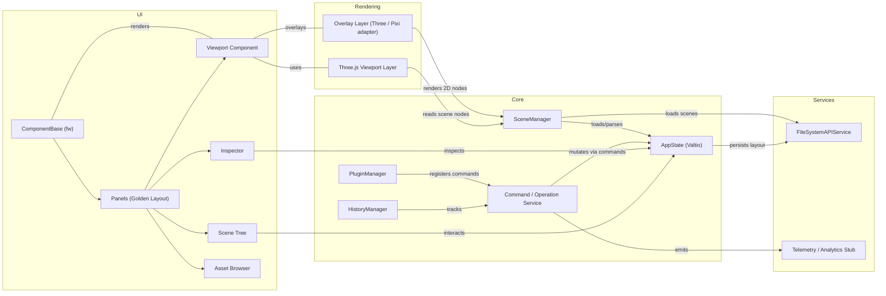

# Pix3 Architecture Diagram

This document contains a high-level architecture diagram for Pix3 and notes about viewing and exporting diagrams in VS Code.

## Mermaid diagram

Below is a Mermaid system diagram that represents the architecture described in `pix3-specification.md` (v1.5).



### How to view

- VS Code has several extensions that render Mermaid and PlantUML diagrams inline:
  - "Markdown Preview Enhanced" (Mermaid support)
  - "Mermaid Preview" and "Mermaid Markdown Preview Enhanced"
  - "PlantUML" for UML diagrams (requires Java)
- Open `docs/architecture.md` in VS Code and use the Markdown preview (Cmd+Shift+V) or the extension-specific preview to render the Mermaid diagram.

### Exporting diagrams

- Use `mmdc` (Mermaid CLI) to export to PNG/SVG:

```bash
# Install
npm install -g @mermaid-js/mermaid-cli
# Export
mmdc -i docs/architecture.md -o docs/architecture.png
```

- For PlantUML diagrams, use the PlantUML extension or the PlantUML CLI (requires Java) to export.

### Notes

- Mermaid is the recommended first choice because it's lightweight and well-supported in Markdown previews for VS Code.
- If you prefer formal UML artifacts or sequence/communication diagrams with richer notation, consider adding PlantUML source files under `docs/diagrams/` and listing them in this document.


